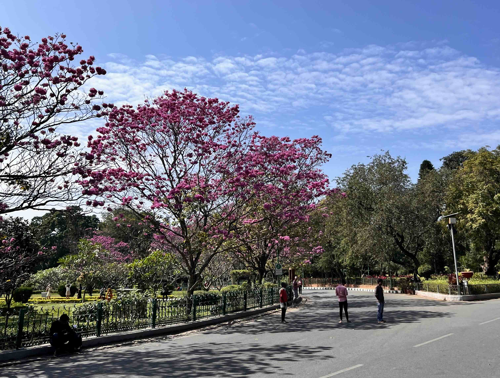

> Inspired by Derek Siver's <a target="_blank" rel="noreferrer" href="https://nownownow.com/about">/now movement</a>.

---

#### January, 2025

##### Life

- Currently engineering impactful & interesting products at <a target="_blank" rel="noreferrer" href="https://cred.club">CRED</a>. 👨‍💻
- Socializing in all new ways. Finding time for friends, making time for new ones.
- Feeling good being back in Bangalore - never knew I will miss the city, but here I am. Life is boring and repetitive, but ironically, it's filled with energy (you know what I mean?).

##### Learning

I want learnings to be a part of life, but, without invading the fun. The list of things I am currently up to:

- Absorbing concepts and wisdoms about building better systems from the following books and sources.
    - <a target="_blank" rel="noreferrer" href="https://www.goodreads.com/book/show/34691716-designing-distributed-systems">Designing Distributed Systems</a>
    - Arpit Bhayani's <a target="_blank" rel="noreferrer" href="https://arpitbhayani.me/blogs">blogs and newsletter</a>.
    - And the system design bible (always in the list), <a target="_blank" rel="noreferrer" href="https://www.goodreads.com/book/show/23463279-designing-data-intensive-applications">Designing Data-Intensive Applications</a>
- Other books that I am reading include:
    - <a target="_blank" rel="noreferrer" href="https://www.goodreads.com/book/show/26026054-it-didn-t-start-with-you">It Didn't Start with You</a>.
    - <a target="_blank" rel="noreferrer" href="https://www.goodreads.com/book/show/181206.The_80_20_Principle">The 80/20 Principle</a>
    - <a target="_blank" rel="noreferrer" href="https://www.goodreads.com/book/show/61439040-1984">1984</a>
    - <a target="_blank" rel="noreferrer" href="https://www.goodreads.com/book/show/31138556-homo-deus">Homo Deus</a>

##### Travel

I try to travel and do short trips and discover places nearby, wherever I am living. But there are also some special places that I want to go to since time immemorial.

- Just finished "South Circuit". This was a trip I wanted to do since a very long time and as I finally got my bike, had to make this a reality. The special thing about it was the long bike ride (2000+ kilometers), hitting various beautiful South Indian spots and ending the new year on a high note. You can view the <a target="_blank" rel="noreferrer" href="https://www.instagram.com/s/aGlnaGxpZ2h0OjE3OTEzMTQwOTY0MDAzNjE0">highlight of the trip on Instagram</a> for now until it's available on <a target="_blank" rel="noreferrer" href="https://imprints.saurabhthakur.dev">Imprints</a>.
- Next up is Leh with friends, let's see if it becomes a reality!
- Want to see snowfall at the end of 2025 in some Himalayan village.
- New Zealand is stuck inside my head now. The natural landscapes that it offers are beautiful. I just dream of driving in a car across New Zealand now and hope to make this a reality soon. 🇳🇿

##### What else?

- Taking time to get bored. Getting comfortable with it.
- Eating good food. It's so easy to miss out on such a simple thing, but feeling great that body doesn't crave the bad food as much now.
- Working out regularly, have made it a part of life. 🏋️‍♂️

 

---

 

Checkout the blogs that I write to express my thoughts about tech and "other" important stuff [here](/blog).
