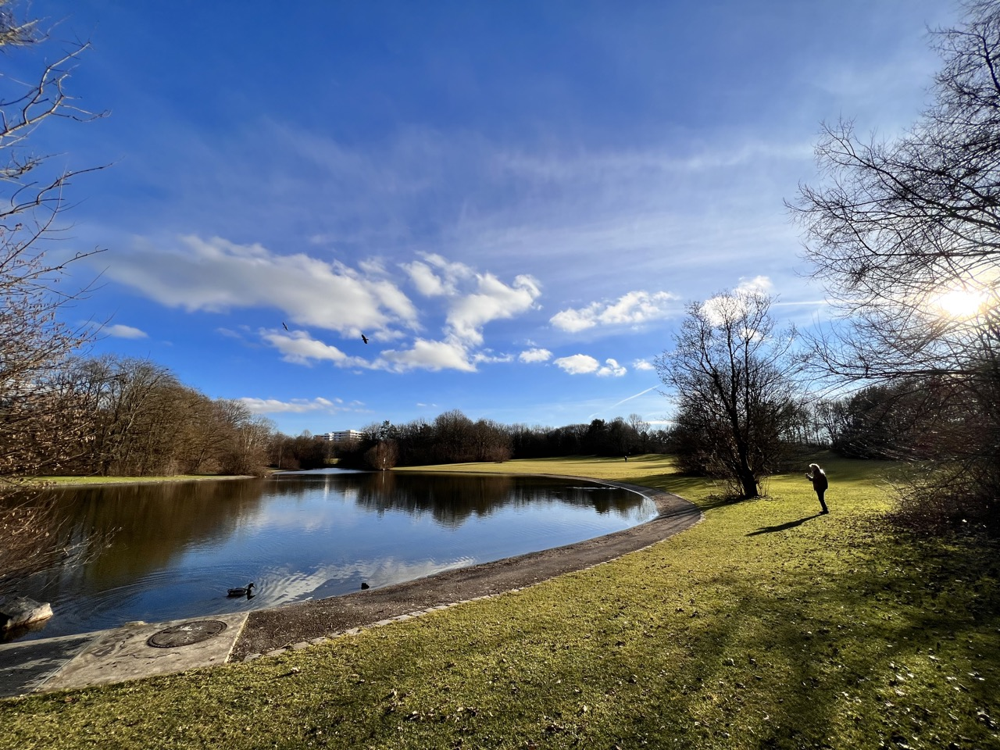

> Inspired by Derek Siver's <a target="_blank" rel="noreferrer" href="https://nownownow.com/about">/now movement</a>.

---

#### January, 2023

##### Life

- Software Engineer at <a target="_blank" rel="noreferrer" href="https://climatepartner.com">ClimatePartner</a>. 👨‍💻
- Been to an office in person after 3 years, enjoying the experience.
- Currently living in Munich, Germany. Recently moved to this beautiful city. Trying to explore it little by little.

##### Learning

I want learnings to be a part of life, but, without invading the fun. The list of things I am currently up to:

- Learning German. 🇩🇪
- Brushing up on basic CS fundamentals. Networking, databases, operating systems, compiler designs, algorithms, data structures etc. ♾
- Absorbing concepts and wisdoms about building better systems from the following books.
    - <a target="_blank" rel="noreferrer" href="https://www.goodreads.com/book/show/23615147-web-scalability-for-startup-engineers">Web Scalability for Startup Engineers</a>
    - <a target="_blank" rel="noreferrer" href="https://www.goodreads.com/book/show/58128.Head_First_Design_Patterns">Head First Design Patterns</a>
    - And the system design bible, <a target="_blank" rel="noreferrer" href="https://www.goodreads.com/book/show/23463279-designing-data-intensive-applications">Designing Data-Intensive Applications</a>
- I have become a regular book reader, which I am very proud of. Currently reading a wide variety of books including:
    - <a target="_blank" rel="noreferrer" href="https://www.goodreads.com/book/show/449573.The_Theory_of_Everything">The Theory of Everything</a>.
    - <a target="_blank" rel="noreferrer" href="https://www.goodreads.com/book/show/57423646-immune">Immune</a>
    - <a target="_blank" rel="noreferrer" href="https://www.goodreads.com/book/show/54898389-the-almanack-of-naval-ravikant">The Almanack of Naval Ravikant</a>

##### Travel

I try to travel and do short trips and discover places nearby, wherever I am living. But there are also some special places that I want to go to since time immemorial.

- Finally ravelled to Spiti 🏔 this summer, a longgggg desire of mine.
- Want to visit Andaman & Nicobar Islands 🏝 by the end of the year. (still speculative)
- Switzerland, some time soon. I can feel the mountains and waterfalls of Lauterbrunnen calling me! 🇨🇭

##### What else?

- Have become a nerd about <a target="_blank" rel="noreferrer" href="https://formula1.com">Formula 1 🏎</a> after watching <a target="_blank" rel="noreferrer" href="https://www.imdb.com/title/tt8289930/">Drive to Survive</a> on Netflix. Have done so much research about terms, historical events, the cars and obviously the players!
- Trying to workout regularly. 🏋️‍♂️
- Want to work on a side project, manifesting a noble idea that is both technically and socially impacting.

 

---

 

Checkout the blogs that I write to express my thoughts about tech and "other" important stuff [here](/blog).
