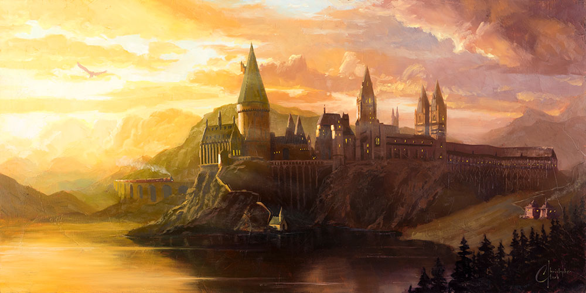
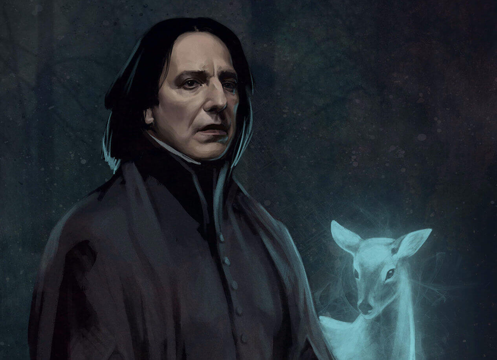

Listening to the words **"Harry Potter"** just shuts down every aspect of this world and takes me to the life filled with adventure and **MAGIC**. Do you also agree or is it just my mind that struggles and wants to be a part of this imaginative universe every time someone mentions it? Nah? Might be me only as this cane be an effect of watching the movies _atleast seven times_ (these are the ones I have counted) and finally reading the books recently...

Harry is a boy who _barely_ lived with Muggles (Non-Magic folks) after his parents died when he was a year old and at the age of 11 got to know that he is a wizard! Flabbergasted by the fact that a boy living under the stairs for the past 11 years can have an interesting life like this didn't convince him but boy was he wrong. For the next 6 years, he went through the adventure, pain and self-realization that takes a lifetime for a mere mortal being to undergo. I wish I was there, in a world where Hogwarts exists.

Don't get me wrong, I am not saying I want the kind of life Harry had, he has suffered problems of a lifetime by the age of 17. I don't think anybody can manage to have a life like his. I am just saying that I wanted to be a part of the world where there was a steam train which took me to Hogwarts along with my friends, where I could play Quidditch and have a wand, whose one swish and flick could solve the problems I had, normal problems I might say.

> Just look at this beautiful place, who wouldn't want to be here?

There were a lot of characters in the series but we are here to talk about the one character which urged me to watch the movies, again and again, read the books to gather information in detail that what happened that lead to the life he had. The person who **"always"** loved Lily. Any guesses here who I am talking about?

### Severus Snape

An exceptionally skilful wizard whose coldly sarcastic and controlled exterior conceals deep emotions and anguish.

He is my favourite character in the series and I also commend Alan Rickman for the role he played so well. Rest in Peace Alan.

J. K. Rowling created the character so mysterious and so well concealed that she wasn't able to unravel till the end.
The way Rowling tried to justify Snape didn't do well with me. I was hurt, I was in agony when even after reading the books I didn't get the answers I wanted.

Why was Snape a part of the Death Eaters even after Lily showed her deep concerns about it?

Didn't he love her enough to come through it?

Was that more important than her?

Why were there no words from Harry even after looking to Snape's memories after his death and what all he did for him? (even with the thoughts of her mother)

I wasn't contempt only by listening that he named his child after Severus, I wanted what he thought thoroughly.

I think that Rowling left a hole in the story by not answering all these questions and this is the flaw that I can't overcome.

What do you think? Can you answer these questions for me? If yes you can reach me out <a target="_blank" rel="noreferrer" href="https://t.me/thakursaurabh1998">here</a>.

##### P.S.

These are my thoughts, how I felt after reading the Harry Potter books. Your views may vary from mine and I respect that.
I tried to share what I feel in this new type of genre I have written for the first time. Apologies for the mistakes.

Image Credits:

- <a target="_blank" rel="noreferrer" href="https://geektyrant.com/news/beautiful-new-book-cover-art-for-the-harry-potter-series-created-for-the-20th-anniversary">Banner</a>
- <a target="_blank" rel="noreferrer" href="https://www.flickr.com/photos/christopherclarkart/27183013138/in/photostream/">Hogwarts</a>
- <a target="_blank" rel="noreferrer" href="https://www.artstation.com/artwork/rJl9a">Severus Snape</a>
