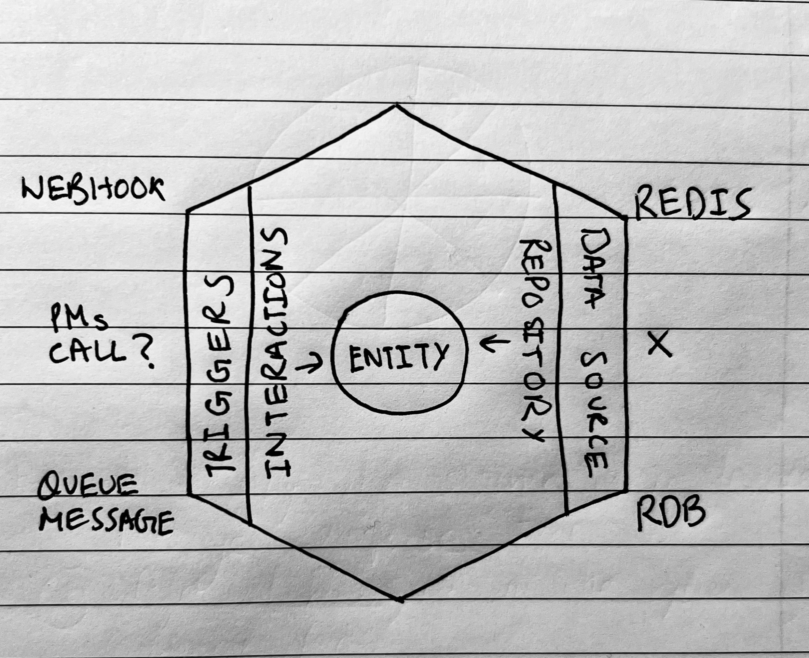
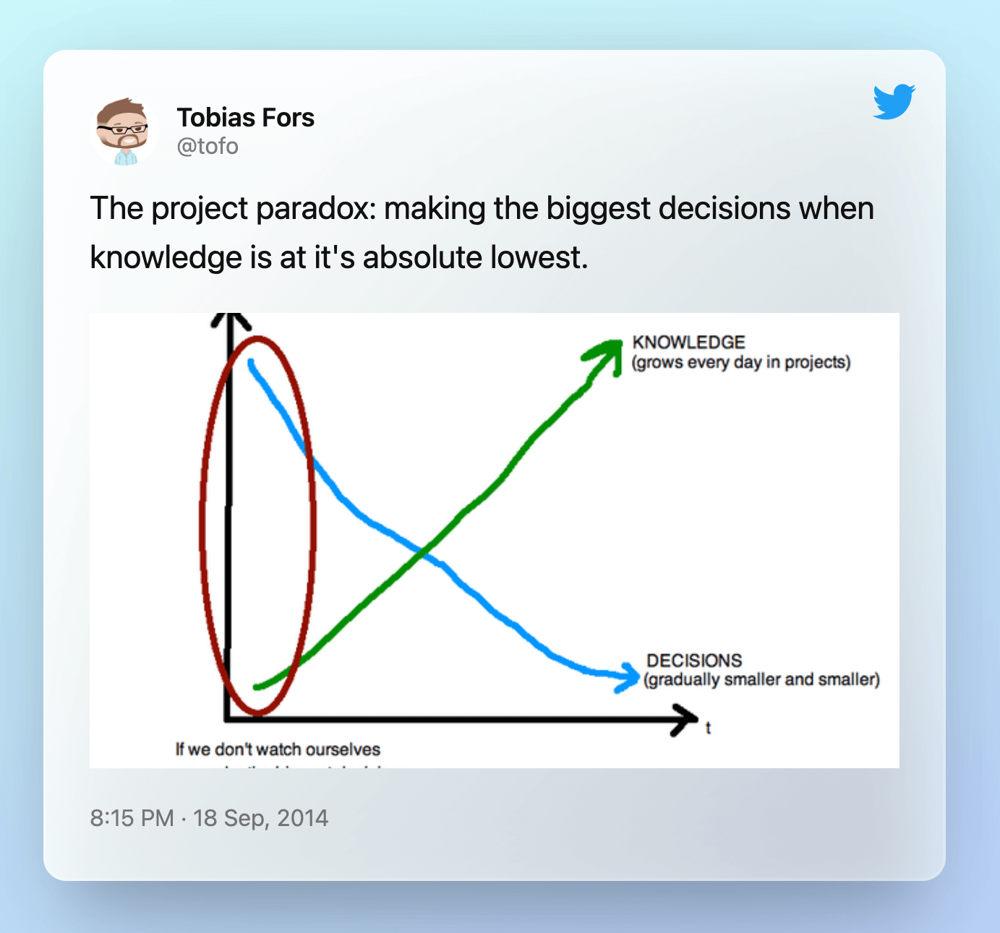

Building large-scale applications from the ground up requires difficult decision-making by the stakeholder groups at a time when you don't even know what the future of your project might look like. Fundamental parts of a project or a service might need to be changed any time in the future due to unexpected traffic or growth, the introduction of a new feature set, or any such infinite scenarios. The fundamentals include what data source you're using (relational, non-relational, document-based, APIs, and so on) and what triggers you're using (any stimuli that tells your system to perform an action on the data).

### Problems

When a system is growing, being locked into a database that is performing inefficiently is a bad situation to be in, especially when you know that using something else can be way more optimized and cost-saving. One more example: let's assume that the business algorithm that runs using a particular data source has to use a new data source. You were using an API, and now you have to use CSVs to ingest the same data. Another example would be if you were performing a large calculation on a dataset when a web-hook alerted your systems, but the calculation should now be initiated by incoming email requests as well.

In the scenarios above, it can be a pain to update your systems to adapt to and handle a new data source, data persistence, or trigger. This can be a real pain in the <strong>\*\*\*</strong> in a poorly designed system. Using a new database can be a challenge because queries are randomly present everywhere in your codebase. The business logic is entangled with long database queries, and changing a database means updating the way the business logic functions. And any old tests that you wrote, say bye-bye to them; you get the idea.

### Hexagonal Architecture

A hexagonal architecture divides the system into an interchangeable and loosely-coupled set of components. This makes it easy to add, change, or remove any part of the system as rapidly as possible.

> I still don't know why it is termed hexagonal because there are no exact six parts to the system that we talk about, and I found a similar problem discussed on Wikipedia.



Bad handwriting? I know.

Let's understand what the above gibberish means

- **Entity:** Let's say an entity is an object of your system that the codebase and its function understand, for example, a user object. When anybody asks for this entity, it's provided as a simple object, which may look like this:

  ```json
  {
    "name": "Saurabh Thakur",
    "age": 24
  }
  ```

  I am saying may because different languages might make different types of objects, such as an ActiveRecord in Ruby or a JSON object in Javascript. By looking at an entity, nobody can tell if it's coming from a distributed cache, a database, or an API.

- **Repository:** It is an interface that provides getter and setter functions to fetch and save entities to the data source. The repository is the place where you write some code to fetch your data from the data source and make it look like the entity you want.
- **Interactors:** Interactor is the component that triggers our business logic. An interactor can be anything: a web-hook, a queued message, an API call, and so on. It uses the entity to run the business logic.

The outer part of the above diagram depicts components that are highly decoupled and can be changed when the time arises without changing the business logic.

### Advantages

I already talked about the many advantages of having a hexagonal architecture. Allow me to add a few more.

- **Data source abstraction**

  Your application doesn't care if you use MongoDB, Postgres, or some new Chemical X. It only cares that the entity should look the same, and that is handled in the repository interface. Switching databases or simply adding data sources can become less painful and much faster.

- **Testing becomes easier and straight forward**

  Your core business tests remain unchanged in the event of a data source update or a new interactor. This increases the reliability of a system during component updates. Your core logic remains untouched. Also, since your data source is abstracted out, mocking data becomes much easier. Tests become more rapid.

- **Solving the <a target="_blank" rel="noreferrer" href="https://twitter.com/tofo/status/512666251055742977">Project Paradox</a>**

  Your system architecture won't be a blocker for you to suggest changing that database when it really needs to

  <div style="max-width: 500px; margin: auto;">
    
  </div>

This was my explanation of the Hexagonal Architecture, hope you learned something new!

Auf Wiedersehen!
