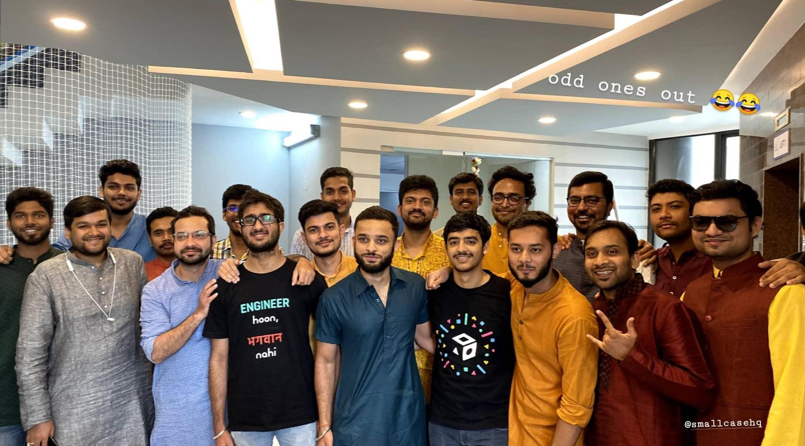

##### Hello guys 👋

The day has finally come to move on. Was feeling anxious about today for some days because smallcase was my first workplace as a professional and I have come a long way along with the company, so understandably the goodbye part is **really hard**.

I might won't do justice to what smallcase has provided me in the past couple of years with my words but I am **_grateful_** to the folks who put their confidence and trust in me for handling the responsibilities here at smallcase. I was a naive kid who came from college and knew nothing about how a company works and what it takes to work around the hurdles. Well some might say I am still a kid (and I cheerfully accept that 😁) but **I have grown a lot as an individual human**.

I got the opportunity to work on almost all of the products under the smallcase ecosystem and I can vouch for the great and successful future of smallcase, as a company, as a product and as a team.

Ironically the best moments for me were the **P0** issues. The bonding spirit that I felt during the **P0** bugs is unparalleled to any other experience. People working with high levels of concentration and coordination, taking each other's inputs and processing the task at hand with little to no sleep sometimes made this whole process a source of adrenaline and the sense of accomplishment when the issue is resolved was always on another level. And obviously Rohan's treat.

Moving ahead, we know and understand that a company is actually it's people. There are good people in this world and then there are **great folks**, and I am lucky to have encountered this greatness at smallcase.

> ⠀<a target="_blank" rel="noreferrer" href="https://twitter.com/adintellect">**Aditya**</a> taught me how to be compassionate and understanding. 
> ⠀<a target="_blank" rel="noreferrer" href="https://www.instagram.com/anchored.me_sara">**Ankur**</a> taught me how to manage things and be patient even in the most stressful times. 
> ⠀<a target="_blank" rel="noreferrer" href="https://twitter.com/gaurav5430">**Gaurav**</a> taught me that experience exhibits superiority. 
> ⠀<a target="_blank" rel="noreferrer" href="https://twitter.com/jbhatia001">**Jatin**</a> taught me that work can be done without orders. 
> ⠀<a target="_blank" rel="noreferrer" href="https://twitter.com/ratancs">**Ratan**</a> taught me how to work together. 
> ⠀<a target="_blank" rel="noreferrer" href="https://twitter.com/agrawalravi95">**Ravi**</a> taught me how to love the work you do. 
> ⠀<a target="_blank" rel="noreferrer" href="https://twitter.com/rohang07">**Rohan**</a> taught me to think properly before speaking. 
> ⠀<a target="_blank" rel="noreferrer" href="https://twitter.com/tarunbatra">**Tarun**</a> taught me how to be a better developer. 
> ⠀<a target="_blank" rel="noreferrer" href="https://twitter.com/umangtiwary">**Umang**</a> taught me how to be reliable and helpful.

Fellow folks without whom this journey would have been _"very different"_ include <a target="_blank" rel="noreferrer" href="https://twitter.com/AdarshHatwar">Adarsh</a>, <a target="_blank" rel="noreferrer" href="https://twitter.com/anurag_rai7">Anurag</a>, <a target="_blank" rel="noreferrer" href="https://twitter.com/achie27_">Archit</a>, <a target="_blank" rel="noreferrer" href="https://www.instagram.com/ashish.io">Ashish</a>, <a target="_blank" rel="noreferrer" href="https://twitter.com/brgvvsst">Bhargav</a>, <a target="_blank" rel="noreferrer" href="https://twitter.com/chithra96293564">Chithra</a>, <a target="_blank" rel="noreferrer" href="https://twitter.com/Devyanibhati15">Devyani</a>, <a target="_blank" rel="noreferrer" href="https://twitter.com/exploit_sh">Harshit</a>, <a target="_blank" rel="noreferrer" href="https://twitter.com/_jaikathuria">Jai</a>, <a target="_blank" rel="noreferrer" href="https://twitter.com/kashifmin">Kashif</a>, <a target="_blank" rel="noreferrer" href="https://twitter.com/gizmopratik">Pratik</a> & <a target="_blank" rel="noreferrer" href="https://twitter.com/pGxplorer_">Pratik</a>, <a target="_blank" rel="noreferrer" href="https://twitter.com/budgetmewtwo">Rahul</a> & <a target="_blank" rel="noreferrer" href="https://www.linkedin.com/in/rahul-kumar-3b0717101">Rahul</a>, <a target="_blank" rel="noreferrer" href="https://twitter.com/soum_yeah">Soumya</a>, <a target="_blank" rel="noreferrer" href="https://twitter.com/shivani96512847">Shivani</a>, <a target="_blank" rel="noreferrer" href="https://twitter.com/iamsubhrajyoti">Subhrajyoti</a> and <a target="_blank" rel="noreferrer" href="https://www.instagram.com/sumit6297">Sumit</a>.

**And all of them together taught me that a workplace can be a fun and interesting place to be at.**

> Diwali 2019 at smallcase HQ

Finally, I can't be thankful enough to each and every person who was a part of this journey because in a way or another you made me a better person. Everyone here is destined for great things that are waiting for them in their future. I hope I get to work again with these amazing minds and souls.

> Stay safe! Take care of yourself and your loved ones so we meet at the other end of this pandemic really soon. 😇

 

---

 

Regards,

**_Saurabh Thakur_**  
I was... Backend Engineer @[smallcase](https://smallcase.com).

Hoping to hear from you at mail@saurabhthakur.dev

---
