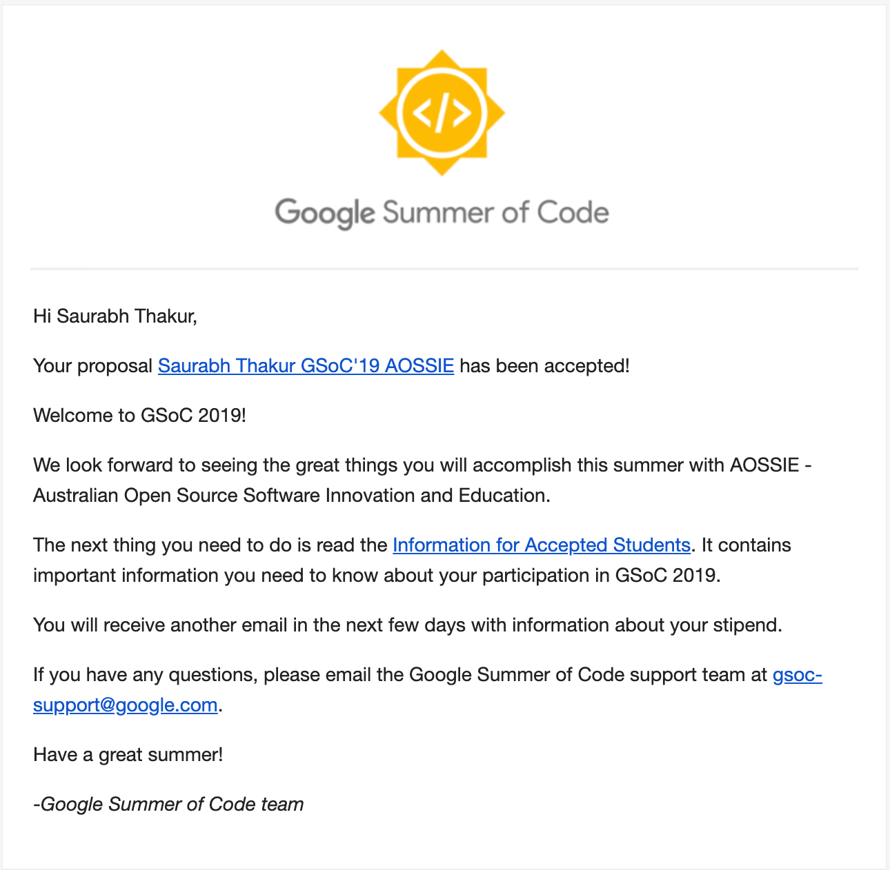

Google <a target="_blank" rel="noreferrer" href="https://summerofcode.withgoogle.com/">Summer of Code</a> is a global program focused on bringing more student developers into open-source software development. Students work with organizations on various projects which they like.
Open-source software is <strong>everywhere</strong>, even if you aren't aware but you are using OSS in some way or another. <a target="_blank" rel="noreferrer" href="https://www.linux.org/">Linux</a>, <a target="_blank" rel="noreferrer" href="https://www.mozilla.org/en-US/firefox/">Firefox</a>, <a target="_blank" rel="noreferrer" href="https://wordpress.com/">Wordpress</a>, <a target="_blank" rel="noreferrer" href="https://www.videolan.org/vlc/index.html">VLC Media Player</a> and many more. As open-source software is free and people do open-source development out of their <i>sheer interest</i>, during Summer of Code, Google provides funds to these organizations so that they can take part and promote OSS development. It is a <strong>win-win</strong> for us as student developers, we get a chance to develop OSS and be part of the community.

We can take full **advantage** of this initiative to contribute to OSS.

> I receive plenty of messages and emails from juniors asking how to start development and how to start working for GSoC, this blog will help me to remove the **repetitive** task of telling every one separately, this will also solve the issue of **me missing** some important points when I tell everyone separately.

---

 

#### Comfort Zone

Before starting to find the perfect project to start contributing, there are somethings which you should be completely **comfortable** with.

##### > <strong>git</strong>

There are a lot of version control systems but the most widely used among organizations is <a target="_blank" rel="noreferrer" href="https://git-scm.com/">git</a>. Making branches, merging them, rebasing, you should be comfortable using the commands.

> ##### Funny tale to tell
>
> I once made a whole feature branch (of a main feature I was working on during my GSoC) **vanish** with a single rebase command.
>
> Scared to guts I banged my head to every wall in the room, not able to find the commits anywhere, a whole month of work **gone**.
> I was not even in the mind of googling how to fix a rebase command because I was having a mindset that rebases can't be fixed.
>
> In anguish the final resort that came to my mind was calling a <a target="_blank" rel="noreferrer" href="https://github.com/sachincool">dear friend</a> of mine to finally discover a command <a target="_blank" rel="noreferrer" href="https://www.atlassian.com/git/tutorials/rewriting-history/git-reflog">**git reflog**</a>.
>
> I am always **stunned** when I think about git and how <a target="_blank" rel="noreferrer" href="https://en.wikipedia.org/wiki/Linus_Torvalds">Linus</a> created it for his use as a personal project.

 

##### > <strong>Prior experiences</strong>

Before contributing to GSoC projects you should have some experience developing your **own projects** or any other project forsake. Having a hobby project also helps a lot in getting a hang of all the bits and pieces you require while working on a project running at a higher level.

 

##### > <strong>Lifecycle of creating issues and PRs</strong>

Working in open source, you have to follow some practices and rules. How to report an issue, how to start working on it, submitting PRs, code reviews and other tasks.

The following diagram breaks down the different stages of how to go through any open source project and start contributing.

 

#### Looking out

After being comfortable with your technical skills, the time comes to visit the **_uncomfortable_** zone.

Now you have to start looking for that one **perfect project**\*\* which _clicks_ with you as well as fits with your tech stack. You can start looking for the projects which were a part of GSoC, in previous years by visiting the <a target="_blank" rel="noreferrer" href="https://summerofcode.withgoogle.com/archive/">archive</a>. Here you can check out what were the proposals made in the previous years, who were the contributors, how they solved an existing problem in the project and so on. By studying how the project is developing in the past years you can have a better insight and will be able to give a better contribution.

> **NOTE:** A perfect project doesn't exist. Everyone is different, some may like to work on a web-based project, others may like to have a Machine Learning project under there portfolio.
>
> It's just that you have to always keep this in mind that you are here to learn, if you are working on a REST API don't compare yourself with someone who is contributing to for example Tensorflow and think that the person is better than you or vice versa (Personal experience). You have to respect everybody's work, in the end, we are all here to learn.
>
> Once you inculcate the sense of responsibility of contributing to open source, who knows tomorrow you are a maintainer of a respectful open source project.

 

#### Bring It Home

Fork the repository and clone the code to your machine. Go through the **README**, and follow the instructions to set up the project. By setting up, I mean install all the dependencies.

Once the project is in a working state, start using it just like a normal user. Start browsing through the application, find if there is any bug, create an issue, go through the code, check if you can fix it.

This initial phase of browsing through a foreign code-base is the most _difficult_ part, but **hang on patiently**, keep following the process and in no time you'll get familiar with the project.

Follow the contribution steps as given in the **CONTRIBUTION** file by the organization. These are the standards you have to follow before any code addition. Also start interacting with other contributors on IRC, gitter or slack(whatever the org uses).

 

#### Application Preparation

The <a target="_blank" rel="noreferrer" href="https://summerofcode.withgoogle.com/how-it-works/">current timeline</a> contains the necessary information required for a GSoC aspirer, and one of the most important information displayed is the deadline for application submission.

Development and coding aside, your **_application plays an important role_** and can be a deciding factor of your name getting selected in the upcoming list of the participants for the following year.

Start from the top, tell them how you can improve the project, and how your contribution can make an _impact_ on the existing projects. List all the changes and work you propose to do during your time in GSoC.

Also, try to be as **detailed** as possible, _distribute_ the work you will do in terms of weeks. Go in-depth and also explain how you will overcome the technical hurdles.

To show your dedication and element of proof, you should try to include all the contributions you have done in the projects of that particular organization. Include all the issues you created and Merge Requests you opened or had merged. This helps the organization to build a sense of confidence in your work.

For reference here is <a target="_blank" rel="noreferrer" href="/gsoc_proposal.pdf">the application</a> which I submitted.

 

#### Now what?

Now you wait until the day results are announced and you receive this **lovely, gorgeous and the unbelievable** email you were so _anxious_ for.

 

In the end, it's not about the name or the fame that **"Google Summer of Code"** has, neither the **overwhelming** stipend you get, but the **_sense of relief and pride of contributing to something meaningful_** along with the ownership which will be something of more than a project to you, forever.
