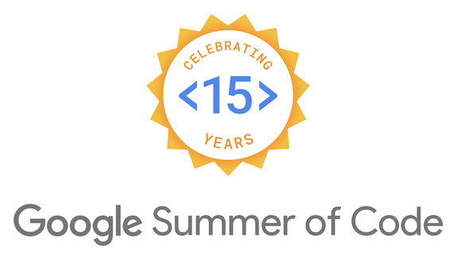
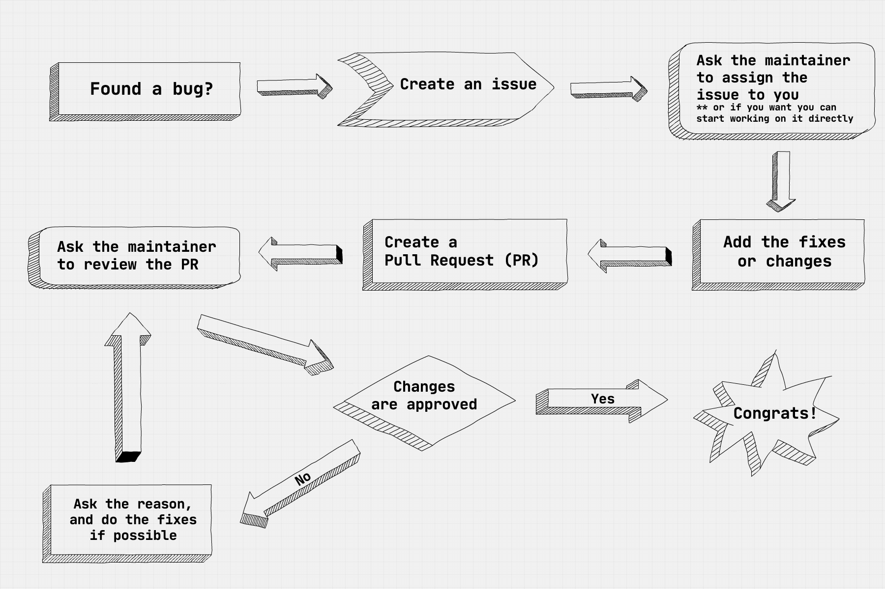

Google <a target="_blank" rel="noreferrer" href="https://summerofcode.withgoogle.com/">Summer of Code</a> is a global program focused on bringing more student developers into open-source software development. Students work with organizations on various projects which they like.
Open-source software is <strong>everywhere</strong>, even if you aren't aware but you are using OSS in some way or another. <a target="_blank" rel="noreferrer" href="https://www.linux.org/">Linux</a>, <a target="_blank" rel="noreferrer" href="https://www.mozilla.org/en-US/firefox/">Firefox</a>, <a target="_blank" rel="noreferrer" href="https://wordpress.com/">Wordpress</a>, <a target="_blank" rel="noreferrer" href="https://www.videolan.org/vlc/index.html">VLC Media Player</a> and many more. As open-source software is free and people do open-source development out of their <i>sheer interest</i>, during Summer of Code, Google provides funds to these organizations so that they can take part and promote OSS development. It is a <strong>win-win</strong> for us as student developers, we get a chance to develop OSS and be part of the community.

We can take full **advantage** of this initiative to contribute to OSS.

> I receive plenty of messages and emails from juniors asking how to start development and how to start working for GSoC, this blog will help me to remove the **repetitive** task of telling every one separately, this will also solve the issue of **me missing** some important points when I tell everyone separately.

---

 

#### Comfort Zone

Before starting to find the perfect project to start contributing, there are somethings which you should be completely comfortable with.

#### \# <a target="_blank" rel="noreferrer" href="https://git-scm.com/"><strong>git</strong></a>

There are a lot of version control systems but the most widely used among organizations is git. Making branches, merging them, rebasing, you should be comfortable using the commands.

> ##### Funny tale to tell
>
> I once made a whole feature branch (of a main feature I was working on during my GSoC) **vanish** with a single rebase command.
>
> Scared to guts I banged my head to every wall in the room, not able to find the commits anywhere, a whole month of work **gone**.
> I was not even in the mind of googling how to fix a rebase command because I was having a mindset that rebases can't be fixed.
>
> In anguish the final resort that came to my mind was calling a <a target="_blank" rel="noreferrer" href="https://github.com/sachincool">dear friend</a> of mine to finally discover a command <a target="_blank" rel="noreferrer" href="https://www.atlassian.com/git/tutorials/rewriting-history/git-reflog">**git reflog**</a>. Some god level stuff <a target="_blank" rel="noreferrer" href="https://en.wikipedia.org/wiki/Linus_Torvalds">Linus Torvalds</a> has invented.

 

#### \# <strong>Lifecycle of creating issues and PRs</strong>

 

#### \# <strong>Prior experiences</strong>

Before contributing to GSoC projects you should have some experience developing your own projects or any other project for sake. Having a hobby project also helps a lot in getting a hang of all the bits and pieces you require while working on a project running at a higher level.

##### To be continued.....
