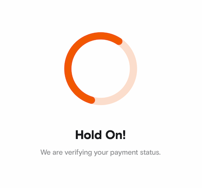
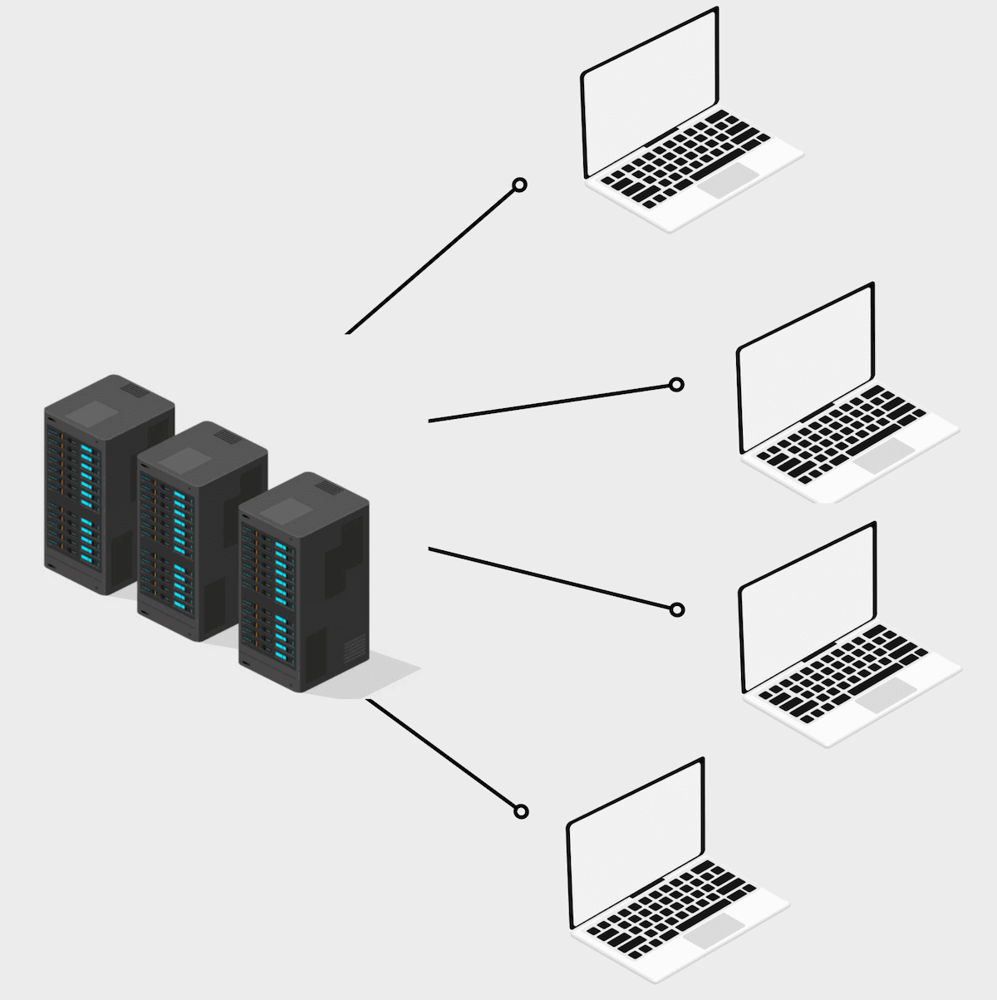
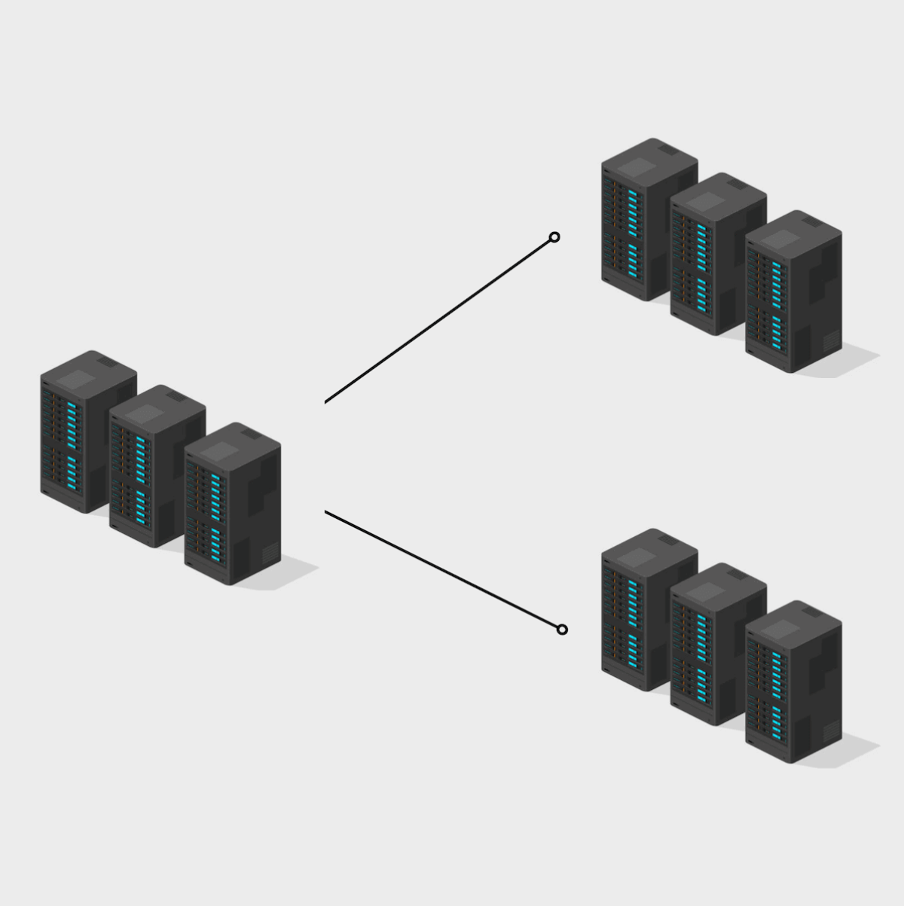

Polling is a technique through which a program checks what is the state of another program by continuously asking for status updates in uniform time intervals. We see the most widely used application of polling in modern-day applications, where a client (web/mobile) polls for the status update of any transaction, which happens to be almost always started by the user and now is waiting for the status update. It can be you placing orders for the delicious food that you are going to have, or buying those pesky little stocks that always turn red just after you buy them 🥲



Every time you are waiting to know what happened when you clicked that button, this is what is happening behind the scenes, your app is asking the server continuously whether it should show you a <span style="color: #448361;">green</span> screen or a <span style="color: #D44C47;">red</span> screen.

### But why is polling required?

Why can't you just go to the next screen after placing the order instantly?

Because things take time, updating the database takes time, and sending your order to the National Exchange takes time, and then it takes more time to get back the status. You get the drill.
Polling makes things easier. There can be two ways to do things.

1. **Synchronous**

   Getting the status update in the same call as which you started the transaction.

   **Pros:** Only a single API call is required, less complex to implement.

   **Cons:** Lower throughput, higher latencies and system becomes complex.
   What if the order was placed successfully but some other thing failed at the backend, will you roll back the order placement now? Or send the failed state to the user?

2. **Asynchronous (polling)**

   Another way that you can create a user flow is, to start the transaction by placing an order, and get an acknowledgement that the system received your request. Then if you want to fetch the status of your order, start polling.

   **Pros:** Separation of concerns, your order placing API has only one thing to do. If it fails it means order placement failed. Simple. Also, a bonus feature that you get is that now after placing the order, the user doesn't have to wait on the same page and can go to any page and come back to the orders page to get the latest status update.

   **Cons:** This can increase the complexity, as you have to create a separate endpoint to fetch the status update.

Who doesn't love the asynchronous way of doing things anyway? Right? 😄

Polling helps us achieve the non-blocking design of software development, that is more efficient and has a better user experience.

### Introduction to polling at the backend

Polling is a simple process and fundamentally remains similar to whichever stack you are working in. The variables that get changed are the environment and scale of things because of which you need to tweak the way you poll.

The below image should help you understand what I mean by the above sentence.

|                                                        |                                                       |
| ------------------------------------------------------ | ----------------------------------------------------- |
|  |  |

The left image shows the case of clients depicting real world users. Here each client is doing polling for their respective statuses. The polling process is running on each individual client so polling happens in distributed manner.

In case of server to server polling things become interesting, a single server can poll statuses for multiple users concurrently. Due to this some complexities are introduced in the system.

The number of polling processes can vary by orders of magnitude, resulting in variable load on the system, that could be calculated in advanced or could be uncertain. Uncertainty in systems reduces an engineer's confidence.

Further we'll be discussing how to poll properly at scale.

### Methods of polling

1. **Timers**

   Just like we poll on the distributed clients, we can similarly do that in our backend processes.

   In clients, we write a code similar to this for polling. Fetch status updates with help of <a target="_blank" rel="noreferrer" href="https://gobyexample.com/timers">`Timers`</a> that are provided by every programming language.

   ```js
   const POLL_INTERVAL = 500;
   const MAX_POLL_COUNT = 10;

   function pollingFunction() {
     return new Promise((resolve, reject) => {
       setTimeout(async () => {
         // API call to server for status update
         resolve();
       }, POLL_INTERVAL);
     });
   }

   async function fetchStatusUpdate() {
     let pollCount = 0;
     let status;
     while (status !== 200 && pollCount < MAX_POLL_COUNT) {
       status = await pollingFunction();
       pollCount += 1;
     }
     // when your program reaches here, either you have received
     // a final status (pass/fail) from the system or your max poll
     // limit has been reached
   }
   ```

   Now, the above procedure makes sense to do in the case of distributed clients where each client only polls their respective statuses but if we try to do polls in a single server for multiple transactions, the timers can quickly pile up and cause unwanted problems in the system.

   If you have 2 instances of a service running on different servers and you use timers the work can get skewed on a single server. It might happen that a single server is doing all the work (polling) which can lead to DoS. Also, we aren't able to distribute the workload properly leading to an unoptimised system taking resources but not doing any work.

   The other thing is that Timers can be inaccurate. You can have significant divergence when you run a lot of timers (and that's what happens at the backend) and especially when running in single-threaded languages like JavaScript, where the event loop also adds to this divergence.

   You can also read <a target="_blank" rel="noreferrer" href="https://www.robofest.net/2019/TimerReport.pdf">this report</a> where the author compares the timers across various languages.

2. **Proposed Solution, use a DLQ**

   There can be other numerous ways of doing this, but the solution I am going to discuss is the one that I have personally worked on, and is currently working at scale handling huge number of polls on a daily basis. (I wish I could give the exact number, but not possible at this moment)

### What's a DLQ?

According to <a target="_blank" rel="noreferrer" href="https://en.wikipedia.org/wiki/Dead_letter_queue">Wikipedia</a>, Dead Letter Queue or DLQ in short, is a service implementation to store messages that meet certain criteria. For us the criteria can be that the message exists in the queue until it expires according to its TTL (time to live).

How it works is that when you want to poll in 1 second interval, you push the message in the queue. The message will have a TTL of 1 second. Once the TTL expires the message gets consumed by the consumer and that's when you ask for the status update. If you have a final status you stop the process but if you haven't and you want to continue with the polling, you push the message back in the queue and the process repeats itself until you reach the polling limit.

I'll be using <a target="_blank" rel="noreferrer" href="http://rabbitmq.com">RabbitMQ</a> as the example for the dead letter queue.

Here's a quick animation to visualise this.

<br />

<div style="position: relative;width: 100%;height: 0;padding-bottom: 56.25%;">
  <iframe
    style="position: absolute;top: 0;left: 0;width: 100%;height: 100%;"
    src="https://www.youtube.com/embed/iHkvp5XIHyQ"
    frameborder="0"
    allow="accelerometer; autoplay; clipboard-write; encrypted-media; gyroscope; picture-in-picture"
    allowfullscreen
  ></iframe>
</div>

<br />
<br />

DLQ solves, the skewing problem as the queue can be used to load-balance the polling tasks among multiple servers and there would never be a server which would be facing the grunt of excess tasks.

> ❓ The case of accurate timers is not solved by the DLQ solution as using a service external to your application will lead to added latencies.

### Bonus section

So I wanted to come up with a library that helps you to poll easily by providing a simple interface and abstracting out the DLQ that you are using.

What I wanted to achieve was something like this:

```js
const userPoll = new Poll(
  {
    interval: 2,
    maxPollCount: 10,
  },
  pollingFunction,
  queueClient,
  logger
);

userPoll.start(user1Data);
userPoll.start(user2Data);
```

What is happening here is that you just provide some basic things necessary for polling and the rest is managed by the library. You provide parameters like polling interval, poll count, and the function that you want to execute on each poll interval. We'll also be providing a queue client that implements some basic functionalities of the queue (this is basically the place where you'll write the infrastructure aware code and can be updated if you decide to change your queue provider). It provides us with functions like `push`, `setTTL` and provides us with an event listener that emits all new messages. This queue client implementation helps us to change/update our queue that we are using anytime in the future without changing a lot of code or the business logic.

Once you have the client implementations set up, your `Poll` class should look something like this.

The constructor:

```js
class Poll {
  /**
   * @typedef options
   * @property {number} interval Interval between each poll in `seconds`
   * @property {number} maxPollCount Max number of times to poll
   *
   * @param {options} options
   * @param {(Object) => Boolean} pollingFunction
   * @param {QueueClientInterface} queueClient
   */
  constructor(
    { interval, maxPollCount },
    pollingFunction,
    queueClient,
    logger = console
  ) {
    this.logger = logger;
    this.interval = interval;
    this.queueClient = queueClient;
    this.maxPollCount = maxPollCount;
    this.pollingFunction = pollingFunction;
  }
}
```

The polling function that is being passed will always return a boolean value. Value signifies if the function wants to continue polling.

Adding the `start` function:

```js {4-16}
class Poll {
    constructor(...) {...}

    /**
     * Start polling
     * @param {object} data dequeued data
     * @param {boolean} prePoll poll before putting to queue
     */
    async start(data) {
        const pollCount = this.maxPollCount;
        this.queueClient.push(this.interval, {
            ...data,
            pollCount,
            interval: this.interval
        });
    }
}
```

We'll now add the `fetchAndValidate` function to the class. The main purpose of this function is to fetch the status from external service and validate if we have received a final status or we need to continue the polling. It does this by executing the polling function that was provided in the constructor.

```js {24-53}
class Poll {
  /**
   * @typedef options
   * @property {number} interval Interval between each poll in `seconds`
   * @property {number} maxPollCount Max number of times to poll
   *
   * @param {options} options
   * @param {(Object) => Promise<boolean>} pollingFunction
   * @param {QueueClientInterface} queueClient
   */
  constructor(
    { interval, maxPollCount },
    pollingFunction,
    queueClient,
    logger = console
  ) {
    this.logger = logger;
    this.interval = interval;
    this.queueClient = queueClient;
    this.maxPollCount = maxPollCount;
    this.pollingFunction = pollingFunction;
  }

  /**
   * @param {(dequeuedData: object) => Promise<boolean>} pollingFunction if this function returns `true`, polling is continued
   */
  async fetchAndValidate(dequeuedData) {
    // the polling function calls the external service to check the status
    const pollContinue = await this.pollingFunction(dequeuedData);
    // We are saving the polls left count with the poll data when
    // it is being pushed to the queue so we can check if polling
    // can be done or not, this count gets altered everytime poll
    // happens
    const pollsLeft = dequeuedData.pollCount - 1;
    if (pollContinue && pollsLeft > 0) {
      // Here we push the data back to the queue with the
      // updated pollCount
      this.queueClient.push(this.interval, {
        ...dequeuedData,
        pollCount: pollsLeft,
      });
    } else {
      // if poll limit is reached or the polling function returns
      // false, we stop the polling, this can be logged if you want
      // or not
      this.logger.warn({
        MQ: {
          msg: "polling limit reached for the following batch",
          details: dequeuedData,
        },
      });
    }
  }
}
```

We'll then add a listener in the constructor that subscribes to the queue and executes the `fetchAndValidate` function whenever a message is consumed.

```js {18-23}
class Poll {
    /**
     * @typedef options
     * @property {number} interval Interval between each poll in `seconds`
     * @property {number} maxPollCount Max number of times to poll
     *
     * @param {options} options
     * @param {(Object) => Promise<boolean>} pollingFunction
     * @param {QueueClientInterface} queueClient
     */
    constructor({ interval, maxPollCount }, pollingFunction, queueClient, logger = console) {
        this.logger = logger;
        this.interval = interval;
        this.queueClient = queueClient;
        this.maxPollCount = maxPollCount;
        this.pollingFunction = pollingFunction;

        // The DLQ pushes all the expired messages to the COLLECTOR_QUEUE
        // and our consumer subscribes to this queue.
        this.mq.listen('COLLECTOR_QUEUE', options);
        this.mq.on('dequeue', (data) => {
            this.fetchAndValidate(data);
        });
    }

    ...
}
```

In the end the completed class should look like this:

```js
class Poll {
  /**
   * @typedef options
   * @property {number} interval Interval between each poll in `seconds`
   * @property {number} maxPollCount Max number of times to poll
   *
   * @param {options} options
   * @param {(Object) => Promise<boolean>} pollingFunction
   * @param {QueueClientInterface} queueClient
   */
  constructor(
    { interval, maxPollCount },
    pollingFunction,
    queueClient,
    logger = console
  ) {
    this.logger = logger;
    this.interval = interval;
    this.queueClient = queueClient;
    this.maxPollCount = maxPollCount;
    this.pollingFunction = pollingFunction;

    // The COLLECTOR_QUEUE is the queue to which our consumer subscribes
    // to as the DLQ pushes all the expired messages to this queue.
    this.mq.listen("COLLECTOR_QUEUE", options);
    this.mq.on("dequeue", (data) => {
      this.fetchAndValidate(data);
    });
  }

  /**
   * @param {(dequeuedData: object) => Promise<boolean>} pollingFunction if this function returns `true`, polling is continued
   */
  async fetchAndValidate(dequeuedData) {
    // the polling function calls the external service to check the status
    const pollContinue = await this.pollingFunction(dequeuedData);
    // We are saving the polls left count with the poll data when
    // it is being pushed to the queue so we can check if polling
    // can be done or not, this count gets altered everytime poll
    // happens
    const pollsLeft = dequeuedData.pollCount - 1;
    if (pollContinue && pollsLeft > 0) {
      // Here we push the data back to the queue with the
      // updated pollCount
      this.queueClient.push(this.interval, {
        ...dequeuedData,
        pollCount: pollsLeft,
      });
    } else {
      // if poll limit is reached or the polling function returns
      // false, we stop the polling, this can be logged if you want
      // or not
      this.logger.warn({
        MQ: {
          msg: "polling limit reached for the following batch",
          details: dequeuedData,
        },
      });
    }
  }

  /**
   * Start polling
   * @param {object} data dequeued data
   * @param {boolean} prePoll poll before putting to queue
   */
  async start(data) {
    const pollCount = this.maxPollCount;
    this.queueClient.push(this.interval, {
      ...data,
      pollCount,
    });
  }
}
```

The above class can be made better by adding more options and overrides according to your own use case.

I never published this as an NPM module as I thought of it as a specific use case but after reading system designs I got to know that it is a pretty common practice and many systems do this.

These were my thoughts about what I learned about polling, especially in the backend and how I tried to write a module that simplifies and abstracts out the infrastructure (queueing service) from the business logic and makes it easier for the developer to implement polling.

<br />
<br />
<br />

###### Resources

<aside>
  PNG's taken from  <a target="_blank" rel="noreferrer" href="https://pngtree.com/so/web">PNGTree</a> and <a target="_blank" rel="noreferrer" href="https://www.freepik.com/vectors">Freepik</a>
</aside>
