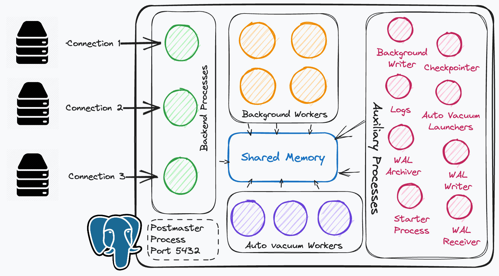

I was very curious about Postgres and it's functioning since a long time and I always wanted to go into details and since I am doing that now, I thought of making some notes. I find these notes to be of fair quality which can be added as an article, so that's what I am doing. I hope you learn something from this.

In this article I am mostly discussing about some components of the Postgres DB engine that are always running behind the scenes which we never get to understand. It's abstracted out so well that sometimes companies scale their Postgres instances, without even tweaking any of the parameters.

> Everything in Postgres works on append only model, meaning every action is added as a new tuple in the Write Ahead Logs (WAL). WAL is an important component in Postgres. I hope to write more about it in upcoming articles.

##### Process vs Threads

- Everything in Postgres is a process
- Because at the time Postgres was written, processes were more safe, stable. But now we can achieve the similar level of stability with threads, without all the overhead.

> 💡 **Pros of using threads** 
> The cache hit ratio on the TLB (Translation Lookaside Buffer) will be better (because memory is shared among multiple threads)

Now let's discuss different processes that are running within Postgres.

### Postmaster Process

This is the listener process that clients connect to. This process starts as soon as the first process i.e the [Starter Process](#starter-process) is completed.

To Postgres its `clients are basically different services that connect to the DB`

When a client connects, the Postmaster process forks a new connection if it isn't already available in the connection pool. It then handovers the connection management to the Backend Process.

### Backend Processes

- Backend processes are responsible for maintaining the client connections.
- Also backend processes are stateful as they basically signify each connection.
- Queries can be executed in Backend Processes but if parallel execution is enabled, they can outsource the work to [Background Workers](#background-workers)

### Connection Pool

- Every Postgres will have a finite number of connections in connection pools, to which the clients can connect.
- Every connection in the connection pool is a **separate process.**
- Postgres have a flag `max_connections` to control the size of the connection pool.

### Shared memory

- This is where WAL records live or Pages until written to disk
- These are shared among different processes
- Have to work with Mutexes and Semaphores here because multiple processes are using the same resource, which can lead to race conditions in data reading/writing.

### Background Workers

- These are limited set of processes
- Because of that we get predictability
  - How we get predictability?
    - When we have a set of workers, we can tell how many of them are busy.
    - But if we let the clients create infinite connections and run queries on those connections, we can't control and have observability of our own resources, for example all the process management will go to the OS scheduler.
    - Here connections can be n and workers can be x (possible values can be n = 100, x = 50)
    - So Postgres will handle all the requests from the connections but will queue the requests until a worker is free _(According to my understanding, need more information)_
    - We can't prioritise when things aren't in our processes control. We're at the mercy of the scheduler.
- If they are busy we tell the Background Processes to wait.
- `max_worker_processes` parameter can be used to tweak the number of background workers

### Auxiliary Processes

Auxiliary processes are secondary or supplementary processes that perform various tasks to support the core functionality of the Postgres system. There are multiple auxiliary processes that are running in the background.

##### Background Writer

1.  Background writer is responsible for flushing things from the shared buffer. 
    It does that by **telling the OS** to write the data to disk.
2.  The **OS doesn't write to the disk instantly** (not scalable), it writes to a file system cache first.
3.  The point is that background writer doesn't make sure that it writes to the disk, it just frees space from the shared buffer. The writing part is delegated to the OS. (pretty smart imo)

##### Checkpointer

1.  Checkpointer is responsible for writing everything (performing all WAL log operations) to the actual data files in the disk (not to the OS, but direct disk write, flag used `O_DIRECT`)
2.  When this happens, a checkpoint flag is added to the WAL. This defines that the data is consistent till that point of time.
3.  In case of a crash we can replay all the operations after a checkpoint from the WAL.

It is also responsible for truncating the WAL segments, resulting in reduced size of the WAL logs.

##### Logs

Writes debug logs, error logs, etc to disk

##### Auto Vacuum Launchers

1.  Vacuum is all the data that is not relevant now, for example all the irrelevant tuples that points to the data of one row, but different versions and operations which are now committed so we don't need all this data. These old tuples can be marked as deleted.
2.  Auto vacuum launchers launches auto vacuum workers to cleanup the vacuum.
3.  It is essential to remove the DB bloat which in turns help in better query optimisation.
4.  They are responsible for managing the vacuum workers. `autovacuum_max_workers` flag can be used to set the number of max workers.

##### WAL Archiver

1.  It archives all the WAL records, basically backs up all the WAL records.
2.  These WAL records are the entities that are pushed to all the replicas, which then use it to replicate data on each node.

##### WAL Receiver

This process runs on replicas which receive the WAL records and create the up to date database state.

##### WAL Writer

1. Responsible for writing the WAL records and flushing them to the disk. WAL Writer is continuously working because the WAL needs to be consistent with all the transactions data that is currently happening.
2. On a commit, WAL writer will perform an action of writing the WAL records, for sure. But it also runs on separate occasions to keep the WAL up to date.
3. This is different than checkpointer process, because the checkpointer is responsible for the actual data files on the disk.
   Whereas WAL Writers responsibility is only to make sure that WAL files are consistently being written to disk.
4. Until the WAL completes writing the data and also the record where we mark that the data is committed, only then we actually consider the data to be committed.

##### Starter Process

1.  The starter process is the first process that actually comes up when we start the database. The database doesn't accept any connections until the starter process finishes its tasks.
2.  The responsibility of the starter process is to check the logs and the current state of the database to see if there are any discrepancies or data mismatch, since the DB could've crashed before writing everything.
3.  If it finds any discrepancies, it simply replays the WAL logs called **“Redo”**. Once that's done and the database state is up to date, it starts accepting connections.
