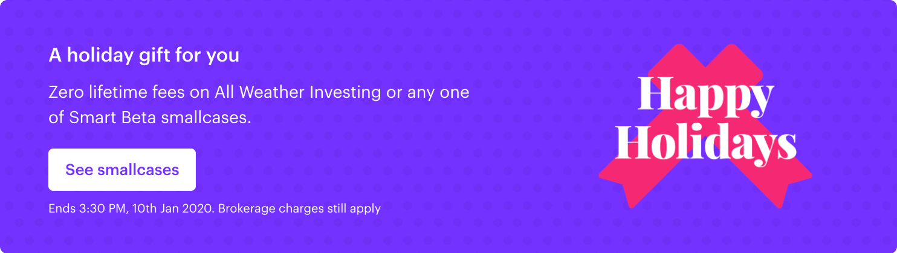
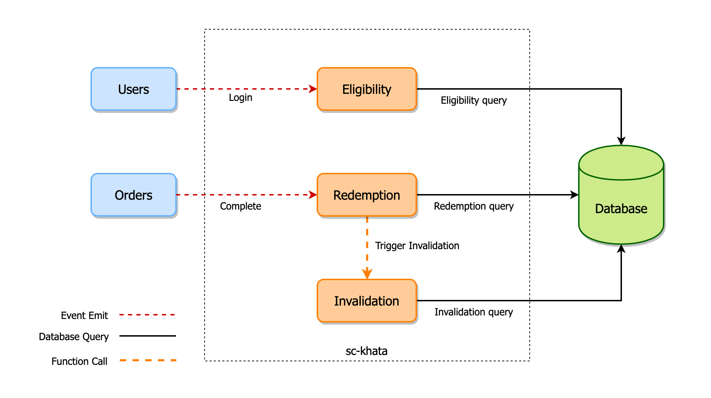

At <a target="_blank" rel="noreferrer" href="https://smallcase.com/">**smallcase**</a>, offers means more than giving discounts to a user, we provide offers to encourage the newer audience to try the platform and discover the possibilities of investing in smallcases.

Growing the number of users of the product utilising offers isn't a new thing and a lot of startups are doing this in the industry. Even smallcase was already providing offers for special occasions such as _Diwali_, _New Year_ to a smaller number of people. But with the rate of growth we are having, that quickly became a bottleneck as activating offers was becoming quite a tedious task.

Activating offers on smallcase platform is now a piece of cake, anyone can do this with some few clicks. This becomes possible because of the revamped Offers microservice, which decouples the application and redemption of an offer from the main platform services and provides a simple interface which can be used to roll out new offers.


<br />

### <span id="setbacks">Setbacks with the previous implementation</span>

As said the previous implementations had some problems which arose due to the scale as well the sudden necessity of adding a wide range of offers to different cohorts.

> **NOTE:** The term of applying an offer to the user means making the user eligible for an offer, whereas **the redemption** of the offer only happens if the user performs any transaction on the platform or app.

Let's discuss one by one, the issues which we were facing:

- **Scope:**

  The variety of offers was really small due to the supporting infrastructure. Offers were rolled out only on special occasions such as Diwali, but now offers service is used to power [various](#khata-applications) types of offers.

- **Complexity:**

  The older offers were having a rather simpler logic and were given to the users more directly, for example, all the users who haven't invested yet were found and offers were given to them. That's it, that was the only scope which the older offers had.

- **Dependency on Code:**

  The redemption of an offer was done via an event which only checked that the offer is available for the user, then the code had some if conditions which applied the offer to the user if those conditions were passed.

  So for every new offer, either the offer should be similar to pass the written conditions or the code needed some changes to add new conditions for every new offer which will need deployments each time.

- **Manual Work:**

  Whenever an offer was to be introduced on the platform, a dedicated person with the backend team was assigned who ran queries to make a user eligible for an offer. The query included the criteria for matching the user which is eligible for the offer. This took **time and manual intervention**, resulting in a solution which is not scalable.

<br />

### sc-khata to the rescue

**sc-khata**(khata is a hindi word meaning account) is a new service written with sole purpose of managing the **smallcase ledger** of all the user transactions on the smallcase platform, including all the applicable offers (moving the ledger to sc-khata is a future task, the ledger service is currenlty an old cron-job).

Khata is based on <a target="_blank" rel="noreferrer" href="https://www.oreilly.com/library/view/software-architecture-patterns/9781491971437/ch02.html">Event Driven Architecture</a>, where it consumes the event produced by the **smallcase API** and **Order Management System** primarily, for the processing of the offer.


Most of the event driven services at smallcase use <a target="_blank" rel="noreferrer" href="https://kafka.apache.org/">Kafka</a> because of the advantages it provides:

- **Fault tolerant:** The inherent capability of Kafka to be resistant to node/machine failure within a cluster.
- **Durability:** The data/messages are persistent on disk, making it durable and messages are also replicated. Messages can be replayed if necessary, or in a time of down-time.
- **High-throughput:** Kafka is capable of handling high-velocity and high-volume data using not so large hardware. It is capable of supporting message throughput of thousands of messages per second.
- **Low latency:** Kafka is able to handle these messages with very low latency of the range of milliseconds, demanded by most of new use cases.

So, all these advantages made Kafka an _easy choice_ to implement this service that works asynchronously parallel to the main platform services and completes the required job without a high latency value.

<br />

### How sc-khata works?


**1.** An offer which is currenlty active in the smallcase eco-system exists.

**2.** If the user is eligible for the offer, the offer gets added to the user account for future use.

**3.** Whenever a user places an order, the offer gets redeemed (from the user's account) and the offer expires.

There were some decisions taken to solve the [above said problems](#setbacks), let us talk about them one-by-one.

<br />

### Shifting the offer logic to the database

Writing the offer logic in the code was not scalable and as already said, to add a new offer, _making changes in code and redeployment_ doesn't makes sense. So now all the offers logic including eligiblity, redemption as well as invalidation, is written in the database. This provides us to **add and update offers on the fly**. 🚀

> But how do you write logic in the database you ask? Right? 🤯

Before explaining that, you need to know how an offer looks like to the system. An offer document is attached below (we use <a target="_blank" rel="noreferrer" href="https://docs.mongodb.com/manual/">MongoDB</a> which is a NoSQL DB, therefore data is stored similar to what is displayed).

<br />

```json {14,21,28}
{
  "status": "AVAILABLE",
  "offerCode": "FREE_AWI",
  "includedScids": ["SCAW_0001"],
  "endDate": ISODate("2020-03-13T10:00:00.000Z"),
  "startDate": ISODate("2020-02-23T18:30:00.000Z"),
  "discount": {
    "type": "percentage",
    "value": 1.0
  },
  "eligibility": {
    "model": "User",
    "operation": "count",
    "query": "{\"broker.userId\":\"<%=brokeruserId%>\",\"investedSmallcases\":[]}",
    "type": "query",
    "expectedResult": 1.0
  },
  "redemption": {
    "model": "Order",
    "operation": "count",
    "query": "{\"brokeruserId\":\"<%=brokeruserId%>\", scid: \"SCAW_0001\", \"batchId\":\"<%=batchId%>\", \"date\":{\"$gte\":\"<%=startDate%>\"}",
    "type": "query",
    "expectedResult": 1.0
  },
  "invalidation": {
    "model": "Order",
    "operation": "count",
    "query": "{\"brokeruserId\":\"<%=brokeruserId%>\",\"batchId\":\"<%=batchId%>\",\"date\":{\"$gte\":\"<%=startDate%>\"},\"buyAmount\":{\"$gt\":0},\"originalLabel\":\"BUY\"}",
    "type": "query",
    "expectedResult": 1.0
  }
}
```

<br />

Some keys are pretty clear like **offerCode**, **startDate** and **endDate**, and the others are explained below:

- **status:** It contains the status of the offer which can either be `AVAILABLE`, `EXPIRED` or `USED`.
- **includedScids:** This array contains all the smallcase ids on which the offer is applicable. Here the offer is only for <a target="_blank" rel="noreferrer" href="https://smallcase.com/awi">All Weather Investing(AWI)</a> smallcase.
- **discount:** Discount can be of 2 types, either a percentage value on the charged amount, or a flat fee discount.
- **eligibility, redemption, invalidation:** All these properties contains some specific keys, which are used in calculating whether or not to complete the respective step. Let's talk about this in detail.

<br />

### Total control, including graphical

In addition to these above keys we have another key called `meta` which plays another significant and beautiful role (quite literally) 🎊🎉

<br />

```json
{
  "meta": {
    "cta": {
      "primary": {
        "text": "See smallcases",
        "action": "DISCOVER",
        "query": "scids=SCAW_0001&scids=SCSB_0001&scids=SCSB_0003&scids=SCSB_0004",
        "path": "/discover/all"
      },
      "secondary": {
        "text": "See all smallcases",
        "action": "DISCOVER"
      }
    },
    "texts": {
      "tnc": "Ends 3:30 PM, 10th Jan 2020. Brokerage charges still apply",
      "title": "A holiday gift for you",
      "description": "Zero lifetime fees on All Weather Investing or any one of Smart Beta smallcases.",
      "subtitle": "Buy now at no lifetime fees"
    },
    "images": {
      "background": "https://assets.smallcase.com/images/offers/NEWYEAR_2020/background.png",
      "foreground": "https://assets.smallcase.com/images/offers/NEWYEAR_2020/foreground.png"
    },
    "style": {
      "backgroundGradient": {
        "startColor": "#7332ff",
        "endColor": "#7332ff"
      },
      "border": {
        "color": "#fff"
      }
    }
  }
}
```

<br />

This object controls how the banner on the smallcase dashboard will look like. From the bold eye catching image to the vivid background gradient color, it provides all the basic info that an offer banner needs. Even the text and the action performed by the button on the banner can be configured with the properties here.

<br />

> **All this results to this beauty that you see on the smallcase dashboard**



### Executing the offers logic

Continuing the explanation of properties of the offer document.

We are using the queries in the doc (highlighted keys above) to query the DB again to find out whether or not the user is eligible for the offer and so on. Every necessary value required to query is provided in the offer document already:

- **type:** Currently the type can be _query_ (like the database query), but for future it can consist of values like _underscore_ where instead of querying to the database we use libraries like <a target="_blank" rel="noreferrer" href="https://underscorejs.org/">underscore</a> for calculation.

- **operation:** This key is used when the _**type**_ key equals _query_. It can have values such as _aggregate_, _count_ which specifies the type of query which we want.

- **model:** Here we specify the collection that needs to be queried. Again only used in case _**type**_ key equals _query_.

- **expectedResult:** Finally the calculated result is compared to this key. If both are equal then the operation is considered to be successful.

- **query:** The real brainstorming was done here, keeping a database query inside the database.

  To convert this non functioning string into a Mongo DB query, something clever was done. <br/>
  Nah! Just kidding we just used a simple function provided by underscore, <a target="_blank" rel="noreferrer" href="https://underscorejs.org/#template">template</a>.<br/>
  We use this to interploate `<%= … %>` values with the specific user's properties dynamically and then parsing it to JSON.<br/>
  _This helps us create a query ready to be executed._

We use <a target="_blank" rel="noreferrer" href="https://mongoosejs.com/">mongoose</a> as the ODM, which let us use the above parsed JSON perfectly to query the database by putting all the values together.

Let's take an example of the `eligibility` key from the offer document above:

<br />

```js
const _ = require('underscore');
const { query, model, operation } = offer.eligibility;

// the query is parsed because the query string in
// the offer document is an undercore string template where
// the variables can be replaced with the provided value
const parsedQuery = JSON.parse(
  _.template(query)({
    brokeruserId: event.data.brokeruserId,
  })
);
// this gives us a parsed JSON query which can be further
// passed on to the mongoose model for querying

// models is an Object which contains the map of
// the collection name to mongoose model of that collection
const result = await models[model][operation](parsedQuery).exec();

if (result === expectedResult) {
  // do the needful
} else {
  // skip everything
}
```

<br />

We saw the code, so now, let's process what is happening logically.<br/>
The query above checks the count of the user whose broker id was provided to verify if the user has **0** invested smallcases.<br/>
If yes, the query returns the count as **1** which equals to the expected result which further means that the user is qualified for the offer and the offer gets pushed to the user.<br/>
If the count came **0**, maybe because the user was already invested, then the user wouldn't have got the offer.

<br />

##### But where and when does all of this happens afterall?

Khata has 3 modules. Eligibility, redemption and invalidation.<br/>
As you might have noticed each of these modules have their own properties in the offer document.



Every module has it's own functionality and peforms it's own tasks at it's invocation.

- **Eligibility:** Figuring out if the user is eligible to any of the offers active in the system. Happens every time when a user login event is produced in kafka.

- **Redemption:** Figuring out if any offer can be redeemed respective to the order placed by the user. Happens everytime when an order is placed by the user.

- **Invalidation:** Figuring out if any offer has expired due to the order placement. Happens after every time redemption module is run.

<br />

### <span id="khata-applications">Current applications of sc-khata</span>

- <a
    target="_blank"
    rel="noreferrer"
    href="https://blog.smallcase.com/muhurat-investing-2019"
  >
    <strong>Promotions:</strong>
  </a> Standard promotional offers such as Muhurat, New Year offers.

- <a
    target="_blank"
    rel="noreferrer"
    href="https://zerodha.com/z-connect/tradezerodha/console-3/referrals-and-rewards"
  >
    <strong>Zerodha referrals:</strong>
  </a> Referral points from zerodha can be used to get an offer on smallcases.

- <strong>Employee offer:</strong> Every smallcase employee is eligible for the employee
  offer under which any smallcase transaction is free of charges.

- <a
    target="_blank"
    rel="noreferrer"
    href="https://blog.smallcase.com/introducing-case-by-case/"
  >
    <strong>case by case:</strong>
  </a> An educational initiative to bring investment lessons and insights from financial
  experts for free. A small quiz at the end of the session could let the users win
  prizes such as fees waived off on buying a smallcase.

<br/>

So sc-khata today is handling **enormous number of events**, **processes numerous offers daily** and has made **execution of business decisions faster** by a significant margin.

>In short it has made the investment life a little bit easier!

Saurabh Thakur signing off..!!
