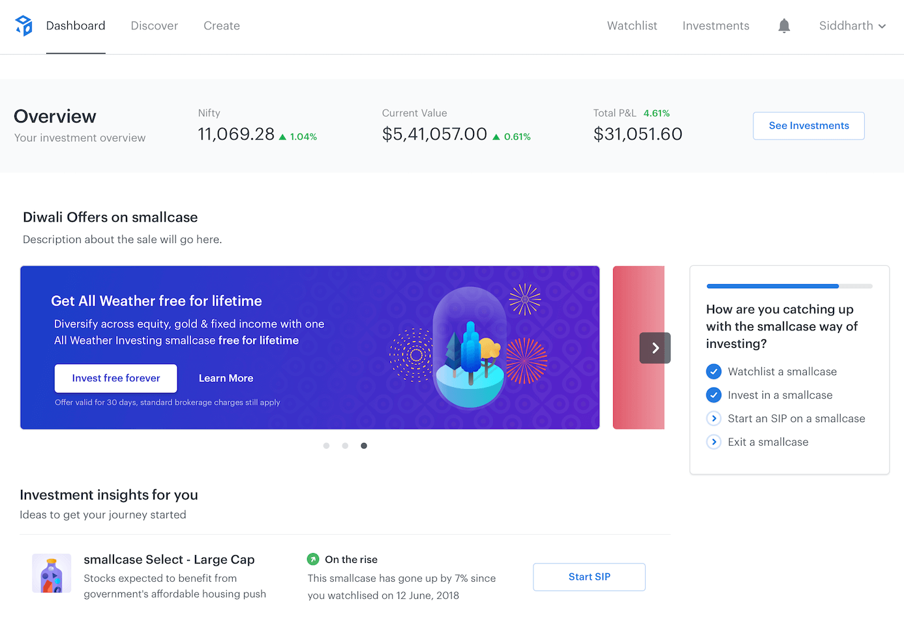
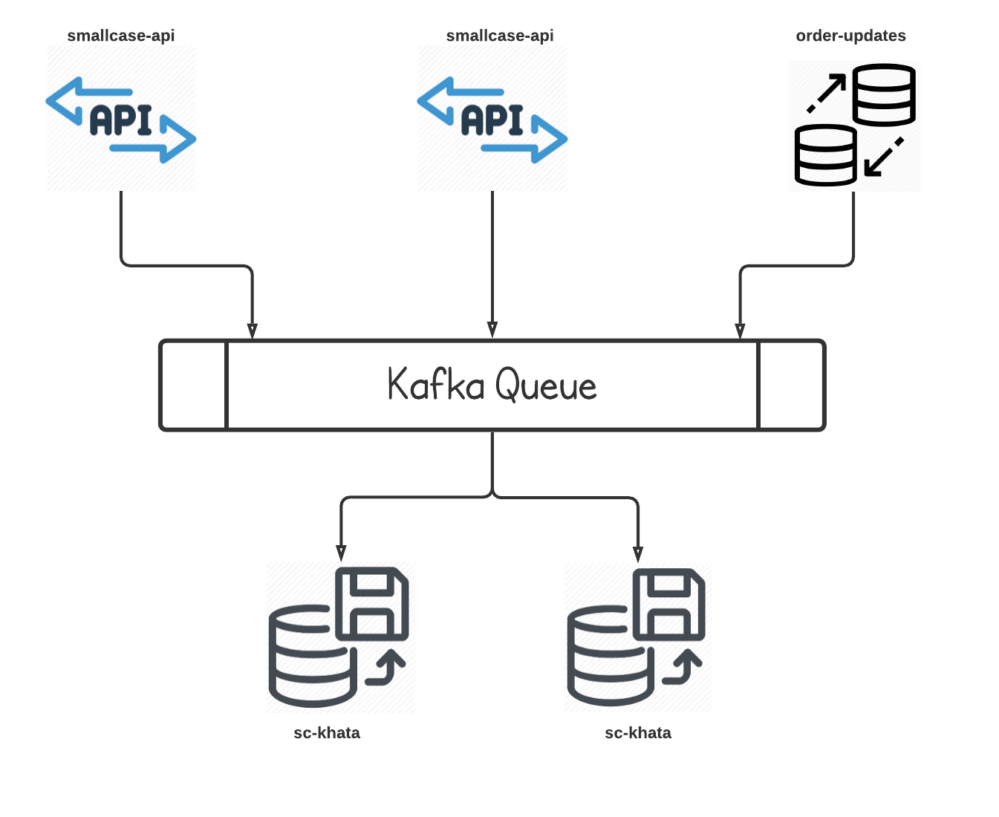

At <a target="_blank" rel="noreferrer" href="https://smallcase.com/">**smallcase**</a>, offers means more than giving discounts to a user, we provide offers to encourage the newer audience to try the platform and discover the possibilities of investing in smallcases.

Growing the number of users of the product utilising offers isn't a new thing and a lot of startups are doing this in the industry. Even smallcase was already providing offers for special occasions such as **//legacy offers//** to a smaller number of people. But with the rate of growth we are having, that quickly became a bottleneck as activating offers was becoming quite a tedious task.

Activating offers on smallcase platform is now a piece of cake, anyone can do this with some few clicks. This becomes possible because of the revamped offers microservice, which decouples the application and redemption of an offer from the main platform services and provides a simple interface which can be used to roll out new offers.

### Setbacks with the previous implementation

As said the previous implementations had some problems which arose due to the scale as well the sudden necessity of applying a wide range of offers to different cohorts.

> **NOTE:** The term of applying an offer to the user means making the user eligible for an offer, whereas **the redemption** of the offer only happens if the user performs any transaction on the platform or app.

Let's discuss one by one, the issues which we were facing:

- **Scope:**

  The variety of offers was really small due to the supporting infrastructure. Offers were rolled out only on special occasions such as Diwali, but now offers service is used to power various types of offers ([details below](#offers-engine-usage))

- **Complexity:**

  The older offers were having a rather simpler logic and were inserted more directly, for example, all the users who haven't invested yet were queried and offers were applied. That's it, that was the only scope which the older offers had.

- **Dependency on Code**

  The redemption of an offer was done via an event which only checked that the offer is available for the user, then the code had some if conditions which applied the offer to the user. So for every new offer, either the offer should be similar so that the if conditions should work in the code or the code needed some changes which will need deployments each time.

- **Manual Work**

  Whenever an offer was to be introduced on the platform, a dedicated person with the backend team was assigned who ran queries to make a user eligible for an offer. The query included the criteria for matching the user which is eligible for the offer. This took **time and manual intervention**, resulting in a solution which is not scalable.

### sc-khata to the rescue

**sc-khata**(khata is a hindi word meaning account) is a new service written with sole purpose of managing the **smallcase ledger** of all the user transactions of the smallcase platform, including all the applicable offers (moving the ledger to sc-khata is a future task, the ledger service is currenlty an old cron-job 😛).

sc-khata is based on <a target="_blank" rel="noreferrer" href="https://www.oreilly.com/library/view/software-architecture-patterns/9781491971437/ch02.html">Event Driven Architecture</a>, where it consumes the event produced by **smallcase-api** and **orders-update** service primarily, for the processing of the offer.

Most of the event driven services at smallcase use <a target="_blank" rel="noreferrer" href="https://kafka.apache.org/">Kafka</a> because of the advantages it provides:

- **Fault tolerant:** The inherent capability of Kafka to be resistant to node/machine failure within a cluster.
- **Durability:** The data/messages are persistent on disk, making it durable and messages are also replicated. Messages can be replayed if necessary, or in a time of down-time.
- **High-throughput:** Kafka is capable of handling high-velocity and high-volume data using not so large hardware. It is capable of supporting message throughput of thousands of messages per second.
- **Low latency:** Kafka is able to handle these messages with very low latency of the range of milliseconds, demanded by most of new use cases.

So, all these advantages made Kafka an _easy choice_ to implement this service that works asynchronously parallel to the main platform services and completes the required job without a high latency value.

### Current Applications of sc-khata

- <a
    target="_blank"
    rel="noreferrer"
    href="https://blog.smallcase.com/introducing-case-by-case/"
  >
    <strong>case by case:</strong>
  </a> An educational initiative to bring investment lessons and insights from financial
  experts for free. A small quiz at the end of the session could let the users win
  prizes such as fees waived off on buying a smallcase. Whenever a user won, API
  produced an event

- <a
    target="_blank"
    rel="noreferrer"
    href="https://zerodha.com/z-connect/tradezerodha/console-3/referrals-and-rewards"
  >
    <strong>Zerodha referrals</strong>
  </a>

Work in progress.....
