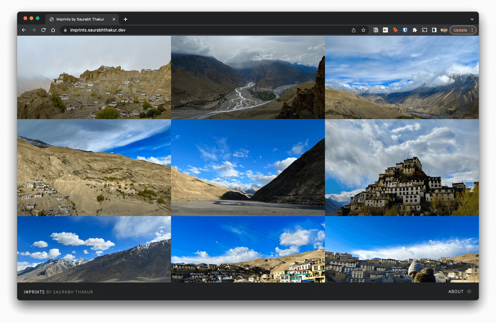

Finally, this happened! I started planning this trip in May 2019, when one of my seniors visited Spiti. Even though I never knew about Spiti before, after reading and checking out some pictures and videos a bit, I was in love. I found out that love, at first sight, is real!

It took me three years to make this a reality but it happened. For the first time, I witnessed this level of the rawness of nature. The weather, the surroundings, the roads, the places we visited, the people, everything left a surreal feeling of emptiness but completeness. I don't know if that's even a thing, but I really felt that!
I had my lovely friends and brother accompanying me on this adventure and couldn't have asked for anything more.
It wasn't just a trip, it was an experience of a lifetime, and I recommend everyone to visit this place once, for what it has to offer to the soul.

Our itinerary included multiple places, and we had to travel almost every day. I am going to leave some pictures of my experiences in my photography website, you can <a target="_blank" rel="noreferrer" href="https://imprints.saurabhthakur.dev">check it out here</a>. I hope you like it.

